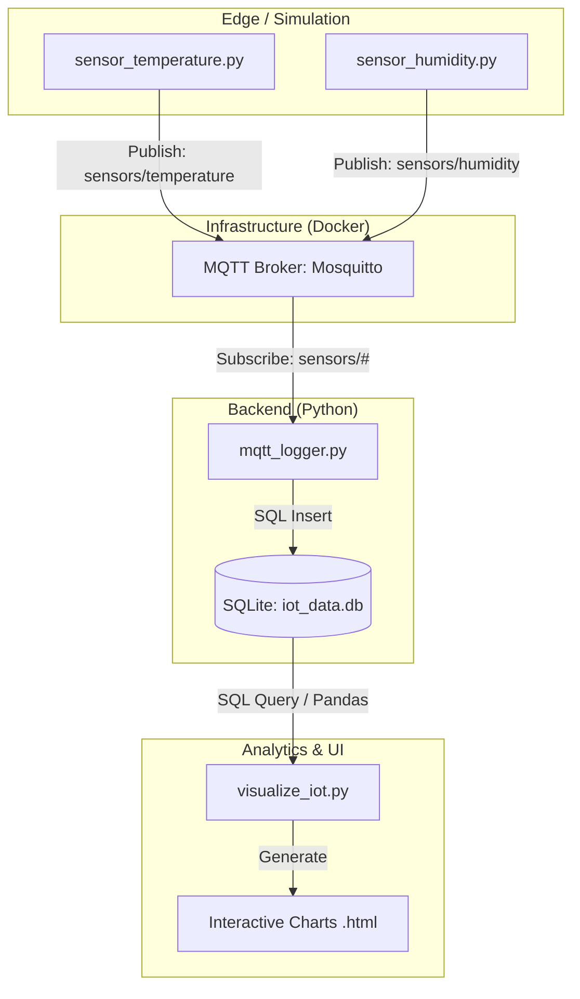
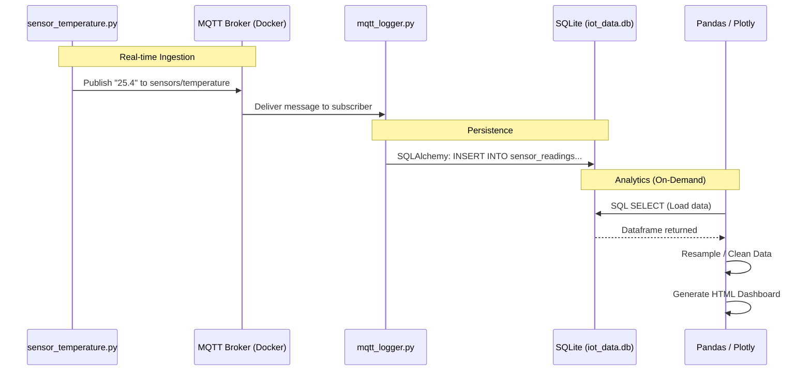

# Week 06 - System Architecture

This document explains how the different components of the Week 06 IoT system interact to move data from sensors to a database and finally to a dashboard.

## Overview

Our system follows a **decoupled architecture**. This means the physical sensors (or simulators) don't need to know anything about the database or the visualization tools. They all talk to a central **MQTT Broker**.

## System Components

### 1. MQTT Broker (Docker)
The **Mosquitto** broker runs inside a Docker container. It acts as the central post office. It doesn't store data permanently; it only passes messages from publishers to subscribers in real-time.

### 2. Sensor Simulators (Python)
Scripts like `sensor_temperature.py` and `sensor_humidity.py` act as **Publishers**. They generate random data and send it to specific **Topics** (e.g., `sensors/temperature`) every few seconds.

### 3. MQTT Logger (The Bridge)
`mqtt_logger.py` is an **MQTT Subscriber** and a **Database Client**.
*   It listens to all topics under `sensors/#`.
*   Whenever a message arrives, it uses **SQLAlchemy** to convert that message into a row in the `sensor_readings` table.
*   This is the "Bridge" that turns ephemeral real-time messages into persistent records.

### 4. Database (SQLite)
The `iot_data.db` file is where the history lives. Unlike the broker, the database remembers everything that has happened since the logger started.

### 5. Data Analytics & Visualization
`visualize_iot.py` and `visualize_challenge.py` are used on-demand.
*   They use **Pandas** to query the SQLite file.
*   They perform "Resampling" (converting seconds of data into minutes or hours).
*   They use **Plotly** to generate HTML files that contain interactive graphs.

## Data Workflow (Sequence)

The following diagram shows the journey of a single temperature reading:

## Why this Architecture?
*   **Scalability:** You can add 100 more sensors without changing a single line of code in the logger.
*   **Reliability:** If your visualization tool crashes, the logger keeps recording data.
*   **Flexibility:** You can replace the SQLite database with a cloud database (like PostgreSQL) later just by changing the connection string in the logger.
