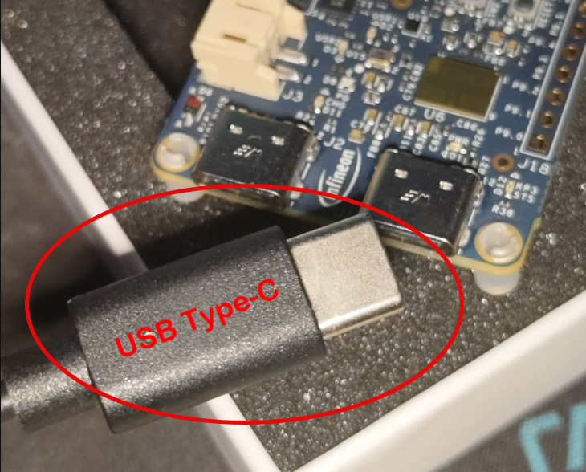

# Week 09: Embedded & IoT Programming using PSoC 6

Welcome to Phase 3! This week, we begin our focus on hardware integration using the **PSoC 6 MCU**.

## Topics
- **Hardware Reading**: Interfacing with physical sensors.
- **Sensor Fusion**: Combining data from multiple sources.
- **JSON Formatting**: Structuring sensor data for IoT payload exchange.
- **Real-Time MQTT**: Publishing data streams to the cloud.

## Hands-on Workshop: PSoC 6 MQTT Sensor Node
This week's practical section focuses on building a real-time MQTT sensor node using the PSoC 6.

**Repository:** [ps6-mqtt-sensors](https://github.com/drsanti/ps6-mqtt-sensors)

### Learning Objectives
1. **ModusToolbox**: Master the build and programming workflow for PSoC 6.
2. **Sensor Interfacing**: Read data from the onboard BMI270 (IMU) and BMM350 (Magnetometer).
3. **Embedded Networking**: Configure Wi-Fi and MQTT clients in a real-time operating system (FreeRTOS) environment.
4. **Data Formatting**: Publish sensor telemetry in a structured format.

---

## Hardware Requirement
> [!IMPORTANT]
> **Please bring a USB Type-C cable to class.**
> The PSoC 6 microcontroller board requires this cable for power and programming.

---
**Course:** AUT561: Internet-of-Things Technologies
**Last Updated:** 2026-03-17